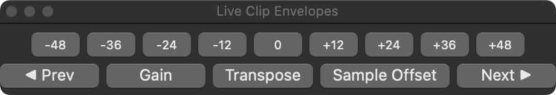

# LiveClipEnvelopes

Restores Ableton Live 8's "quick chooser" workflow for a clip's Gain,
Transposition, and Sample Offset envelopes — as keyboard shortcuts, a floating
button panel, Keyboard Maestro macros, or Apple Shortcuts. macOS only.



Live 12 has no exposed API for selecting which clip envelope is displayed (see
[How it works](#how-it-works)), so this drives Live's actual UI through the
Accessibility API instead: it presses the same Device/Control Chooser popups and
Link/Unlink button you would click by hand. Nothing here writes envelope curve
data — only *which envelope is shown* changes, plus (optionally) the clip's own
transposition value via [AbletonOSC](https://github.com/ideoforms/AbletonOSC).

## What's here

| Piece | What it does |
|---|---|
| `bin/live-envelope.swift` | The core CLI. Everything else just shells out to this. |
| `LiveEnvelopePanel/` | A floating, Dock-launchable button panel (`Live Envelopes.app`). |
| `abletonosc-patch/` | Three small AbletonOSC endpoints this needs (see below). |
| `keyboard-maestro/` | One `.kmmacros` file with all 15 commands, no triggers assigned. |
| `shortcuts/signed/` | The same 15 commands as importable Apple Shortcuts. |
| `scripts/generate-automations.py` | Regenerates the two above from one command list. |
| `package.sh` | Builds the distributable zip (app + CLI + patch + macros + Shortcuts). |
| `gumroad/` | The store page: copy in `page.md`, `./gumroad/deploy.sh` renders and publishes it. |

## Install

```bash
git clone https://github.com/esaruoho/LiveClipEnvelopes
cd LiveClipEnvelopes
./install.sh
```

This builds and installs the CLI to `/usr/local/bin/live-envelope` (asks for
`sudo`) and the panel app to `/Applications/Live Envelopes.app`, offering to pin
it to the Dock. It signs the app with a local code-signing identity if one
exists in your keychain, rather than ad-hoc — see [Accessibility and rebuilding](#accessibility-and-rebuilding)
for why that matters.

Then apply the AbletonOSC patch (only needed for `open`'s auto-reveal fallback
and the transpose commands — see [AbletonOSC endpoints](#abletonosc-endpoints)):

```bash
cp abletonosc-patch/view.py /path/to/AbletonOSC/abletonosc/view.py
# reload from Live: send an OSC message to /live/api/reload, or restart Live
```

## Usage

```
live-envelope <command>

  gain                                    toggle Gain <-> Transposition
  smart | sample offset | transposition   Beats: toggle the two; else Transposition
  transpose-up-12 | transpose-down-12     snap the clip's transposition by an octave
  transpose-set-<n>                       set transposition to an absolute value
                                           (n may be "neg24" etc. -- shells don't
                                           like a bare "-" inside one argument)
  exact <name>                            select <name> verbatim, no substitution
  next | prev                             cycle only what the warp mode offers
  link | unlink | toggle-link             Link/Unlink the displayed envelope
  open                                    pop the chooser menu open (press again to close)
  open-at-mouse                           ... and move it under the pointer
  status                                  print the current chooser state
  list                                    list every entry the chooser offers
```

`gain` and `sample offset` are both toggles, designed to live on two physical
buttons (a mouse's extra buttons, say): `gain` alternates Gain ↔ Transposition;
`sample offset` alternates Sample Offset ↔ Transposition in Beats Warp Mode, and
just selects Transposition in every other mode (Sample Offset doesn't exist
outside Beats). Between them, two buttons reach all three envelopes.

Every command that changes the selection first asks Live to show the Envelopes
box if it's hidden, and switches the Device Chooser to "Clip" if it wasn't
already there — so it works from a clean Sample-tab view, not just when the
Envelopes box is already visible on the right envelope.

### The floating panel

`Live Envelopes.app` — nine transpose buttons (-48 to +48) plus Prev / Gain /
Transpose / Sample Offset / Next, each just running `live-envelope`. The title
bar doubles as a result/error readout: it flashes the command's result (or an
error, held longer) and reverts to "Live Clip Envelopes" after a couple of
seconds.

### Keyboard Maestro / Shortcuts

Both `keyboard-maestro/Live Clip Envelopes.kmmacros` and every file in
`shortcuts/signed/` reference `/usr/local/bin/live-envelope` — the path
`install.sh` uses. If you installed the CLI somewhere else, edit the one
`Execute Shell Script` action (KM) or `Run Shell Script` action (Shortcuts)
inside each.

Neither file assigns a trigger — import them and assign your own hot keys, MIDI
notes, mouse buttons, or run them from Shortcuts' menu bar item / Siri.

To regenerate both from scratch (e.g. after adding a command):

```bash
python3 scripts/generate-automations.py
```

## How it works

Live's `Clip.View` exposes exactly `show_envelope()`, `hide_envelope()`, and
`select_envelope_parameter()` — and that last one requires a
`TPyHandle<ATimeableValue>`, a handle Live's Python API never hands out for a
clip's own Gain / Transposition / Sample Offset ("warper") parameters. They're
plain floats (`clip.gain`, `clip.pitch_coarse`) with no wrapper object anywhere
in the API. `create_automation_envelope()` wants the identical handle, so
there's no way to read or write the actual envelope *curve* either — confirmed
directly against the API, not inferred:

```
Boost.Python.ArgumentError: Python argument types in
    Clip.create_automation_envelope(Clip, float)
did not match C++ signature:
    create_automation_envelope(TPyHandle<AClip>, TPyHandle<ATimeableValue>)
```

So this tool doesn't touch the API for selection at all. It walks Live's
accessibility tree (bounded by depth and node count, and geometrically pruned to
the Envelopes box's screen region — full search takes minutes on a large Set) to
find the **Device Chooser**, **Control Chooser**, and **Link/Unlink Envelope**
controls, and presses them the way you would. Two quirks of Live's
implementation shape the code:

- The choosers' `AXValue` is read-only, so selecting an entry means opening the
  menu and pressing the item, not setting a value directly.
- Pressing a chooser **toggles** its menu open/closed rather than just opening
  it — press again to close.

## AbletonOSC endpoints

Three small additions, none touching envelope content:

| Endpoint | Purpose |
|---|---|
| `/live/view/show_clip_envelope` | Used as a fallback when the Envelopes box isn't visible at all (only `Clip.View` calls, not accessibility). |
| `/live/view/nudge_clip_transposition` | Adds a signed semitone delta to the displayed clip's `pitch_coarse`, clamped to -48..48. Backs `transpose-up-12` / `-down-12`. |
| `/live/view/set_clip_transposition` | Sets `pitch_coarse` to an absolute value. Backs `transpose-set-<n>`. |

**Caveat, stated plainly:** these three write the clip's *scalar* transposition
value. If a Transposition envelope curve is already drawn on the clip, the drawn
curve still determines playback — Live's API has no way to clear a single warp
parameter's envelope (only `clip.clear_all_envelopes()`, which removes every
envelope on the clip, including unrelated ones, so this tool never calls it).

## What this can't do

- **Edit envelope curve content** (draw/clear breakpoints for Gain/Transposition/
  Sample Offset) — no API path exists, as shown above. The only remaining route
  is simulating actual mouse drags on the drawn curve, which is a different,
  much more fragile kind of automation than anything else here and isn't
  implemented.
- **Duplicate an envelope's loop + content** (Live's own Cmd-D behavior) — the
  Python `duplicate_loop()` method exists but errors "only available for Midi
  clips" on an audio clip. No menu item reaches the same operation either
  (`Select Loop` + `Duplicate Time` was tested and does nothing to the clip's
  loop bounds). The Position/Length sliders for an *unlinked* envelope's own
  loop region are visible to accessibility but report `settable=false`
  (drag-only).

## Requirements

- macOS, Ableton Live 12 (built and tested against 12.4.x)
- [AbletonOSC](https://github.com/ideoforms/AbletonOSC) installed as a Live
  Control Surface, for the transpose commands and the `open` auto-reveal
  fallback
- Accessibility permission for `live-envelope` (granted per-process; a Dock
  app spawning it as a child, like the panel here, needs its own grant — see
  below)
- Xcode Command Line Tools (`swiftc`) to build

## Accessibility and rebuilding

If you edit and rebuild the panel app, macOS may ask you to re-grant
Accessibility access every single time — this happens with **ad-hoc** code
signing (`codesign -s -`), which embeds a hash of the exact binary bytes in its
designated requirement, so every rebuild is a new identity as far as TCC is
concerned. Signing with a real (even self-issued, non-Apple-notarized)
certificate fixes this, because the identity then depends on the certificate,
not the binary content — verified empirically while building this: rebuilding
and re-signing with the same certificate did not re-trigger the prompt.
`install.sh` does this automatically if it finds a codesigning identity in your
keychain (Keychain Access → Certificate Assistant → Create a Certificate →
type "Code Signing" is enough).

This matters specifically for the panel app because it never calls an
Accessibility API itself — only the `live-envelope` child process it spawns
does — and macOS attributes that permission check to the panel as the
"responsible process."

## Prebuilt download

The source here is complete and MIT-licensed — `./install.sh` builds everything
from scratch for free. If you'd rather skip the build, a prebuilt, code-signed
bundle (app + CLI + all macros and Shortcuts + install notes, one zip) is on
Gumroad for €10, which also funds the work:

**https://lackluster.gumroad.com/l/liveclipenvelopes**

Build it yourself or buy it — both are fine.

## Support

If you find this tool useful:
- [Ko-Fi](https://ko-fi.com/esaruoho)
- [BuyMeACoffee](https://buymeacoffee.com/esaruoho)
- [PayPal](https://www.paypal.me/esaruoho)
- [GitHub Sponsors](https://github.com/sponsors/esaruoho)
- [Patreon](http://patreon.com/esaruoho)
- [Bandcamp](http://lackluster.bandcamp.com/)

## Credits

Created by Lackluster (esaruoho)

Built on top of [AbletonOSC](https://github.com/ideoforms/AbletonOSC) by Daniel Jones.

## License

MIT — see [LICENSE](LICENSE).
